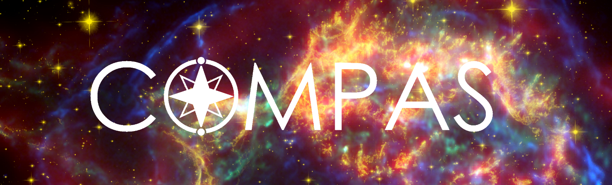

[//]: ## (grip -b README.md)

# Compact Object Mergers: Population Astrophysics & Statistics

[//]: ## (Outline features)
COMPAS is a publicly available rapid binary population synthesis code (https://compas.science/) that is designed so that evolution prescriptions and model parameters are easily 
adjustable.  COMPAS draws properties for a binary star system from a set of initial distributions, and evolves it from zero-age main sequence to the end of its life as two compact 
remnants.  It has been used for inference from observations of gravitational-wave mergers, Galactic neutron stars, X-ray binaries, and luminous red novae.

## Documentation
https://compas.science/docs

## Contact
Please email your queries to compas-user@googlegroups.com. You are also welcome to join the [COMPAS User Google Group](https://groups.google.com/forum/#!members/compas-user) to engage in discussions with COMPAS users and developers.

## Acknowledgements
If you use this code or parts of this code for results presented in a scientific publication, we would greatly appreciate if you send us your paper reference and make your input settings and output data publicly available by uploading it to the [COMPAS Zenodo community](https://zenodo.org/communities/compas/). Please also kindly include citations to our COMPAS methods paper https://ui.adsabs.harvard.edu/abs/2021arXiv210910352T/abstract. As the public COMPAS code is a product of work by the entire COMPAS collaboration over many years, we kindly request that, in recognition of this team effort, the paper is cited as “Team COMPAS: J. Riley et al.”. An example bibtex code is:

@ARTICLE{COMPAS:2021methodsPaper,
       author = {{\noopsort{Team COMPAS}}{Team COMPAS: J. Riley} and  {Riley}, Jeff and {Agrawal}, Poojan and {Barrett}, Jim W. and {Boyett}, Kristan N.~K. and {Broekgaarden}, Floor S. and {Chattopadhyay}, Debatri and {Gaebel}, Sebastian M. and {Gittins}, Fabian and {Hirai}, Ryosuke and {Howitt}, George and {Justham}, Stephen and {Khandelwal}, Lokesh and {Kummer}, Floris and {Lau}, Mike Y.~M. and {Mandel}, Ilya and {de Mink}, Selma E. and {Neijssel}, Coenraad and {Riley}, Tim and {van Son}, Lieke and {Stevenson}, Simon and {Vigna-Gomez}, Alejandro and {Vinciguerra}, Serena and {Wagg}, Tom and {Willcox}, Reinhold},
        title = "{Rapid stellar and binary population synthesis with COMPAS}",
      journal = {arXiv e-prints},
     keywords = {Astrophysics - Instrumentation and Methods for Astrophysics, Astrophysics - High Energy Astrophysical Phenomena, Astrophysics - Solar and Stellar Astrophysics},
         year = 2021,
        month = sep,
          eid = {arXiv:2109.10352},
        pages = {arXiv:2109.10352},
archivePrefix = {arXiv},
       eprint = {2109.10352},
 primaryClass = {astro-ph.IM},
       adsurl = {https://ui.adsabs.harvard.edu/abs/2021arXiv210910352T},
      adsnote = {Provided by the SAO/NASA Astrophysics Data System}
}

Note that the preferred acknowledgement relies on \noopsort; to make it work, you'll have to include the following line at the start of your bibtex file:
@PREAMBLE{ {\providecommand{\noopsort}[1]{}} }

In addition, we suggest to kindly include the two following papers:

1. Stevenson S., Vigna-Gómez A., Mandel I., Barrett J. W., Neijssel C. J., Perkins D., de Mink S. E., 2017, [Nature Communications, 8, 14906](https://ui.adsabs.harvard.edu/abs/2017NatCo...814906S/abstract)
2. Vigna-Gómez A., Neijssel C. J., Stevenson S., Barrett J. W., Belczynski K., Justham S., de Mink S., M&uuml;ller B., Podsiadlowski Ph., Renzo M., Szécsi D., Mandel I., 2018, [MNRAS, 481, 4009](https://ui.adsabs.harvard.edu/abs/2018MNRAS.481.4009V/abstract)

We also greatly appreciate an acknowledgement of the form: 

>_Simulations in this paper made use of the COMPAS rapid binary population synthesis code (version X.X.X), which is freely available at http://github.com/TeamCOMPAS/COMPAS_.

Furthermore,

  * If you use COMPAS's importance sampling algorithm STROOPWAFEL, please cite 

     Broekgaarden F. S., Justham S., de Mink S. E., Gair J., Mandel I., Stevenson S., Barrett J. W., Vigna-Gómez A., Neijssel C. J., 2019, [MNRAS, 490, 5228](https://ui.adsabs.harvard.edu/abs/2019MNRAS.490.5228B/abstract)

  * If using the COMPAS model of gravitational wave selection effects, please cite

     Barrett J. W., Gaebel S. M., Neijssel C. J., Vigna-Gómez A., Stevenson S., Berry C. P. L., Farr W. M., Mandel I., 2018, [MNRAS, 477, 4685](https://ui.adsabs.harvard.edu/abs/2018MNRAS.477.4685B/abstract)

  * If using COMPAS's integration over cosmic star formation history, please cite 

     Neijssel C. J., Vigna-Gómez A., Stevenson S., Barrett J. W., Gaebel S. M., Broekgaarden F. S., de Mink S. E., Szécsi D., Vinciguerra S., Mandel I., 2019, [MNRAS, 490, 3740](https://ui.adsabs.harvard.edu/abs/2019MNRAS.490.3740N/abstract)

  * If using the COMPAS model of (pulsational) pair instability supernova, please cite 

     Stevenson S., Sampson M., Powell J., Vigna-Gómez A., Neijssel C. J., Szécsi D., Mandel I., 2019, [ApJ, 882, 121](https://ui.adsabs.harvard.edu/abs/2019ApJ...882..121S/abstract)
     
  * If evolving pulsar spins and magnetic fields with COMPAS, please cite
  
     Chattopadhyay D., Stevenson S., Hurley J. R., Rossi L. J., Flynn C., 2020,  [MNRAS](https://ui.adsabs.harvard.edu/abs/2020MNRAS.tmp..697C/abstract)

## License
[MIT](https://choosealicense.com/licenses/mit/)

### Highlighted papers that have made use of COMPAS are listed at https://compas.science/science.html ; see https://ui.adsabs.harvard.edu/public-libraries/gzRk1qpbRUy4cP2GydR36Q for a full ADS library

