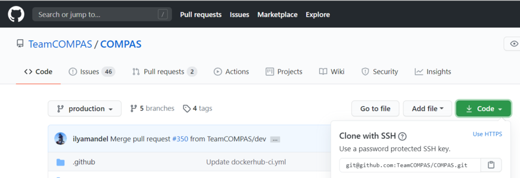

[//]: ## (grip -b git_workflow.md)

# Git Workflow for COMPAS software developers

---

## Contents of this document

### [Introduction](#introduction)

### [Getting Set Up](#getting-set-up)

### [Day to Day Commands](#day-to-day-commands)

### [Lifetime of a Project](#lifetime-of-a-project)

### [COMPAS Git Workflow](#the-compas-git-workflow)

### :star: [Terminology](#terminology) :star:

---

# Introduction

### Git & Github for COMPAS developers
For those who are unfamiliar, git and github are popular tools in the software development community for sharing and collaborating on software projects. 

Git is a light-weight command line tool for maintaining different versions of software locally, and sharing those versions to remote servers.
Github is a website that stores git-managed projects and enables developers to collaborate centrally on many projects. 

It is a bigger topic than we can get into here, but if you are curious you should [read more here.](https://www.atlassian.com/git/tutorials/what-is-version-control) 

Learning git is somewhat similar to learning a new language, and it can be difficult to fully grasp the vocabulary when starting out (which makes searching the internet for help significantly more challenging!).
Some of the most fundamental terms are [described below](#terminology) to assist new users.

---

### Purpose of this document
The purpose of this document is to:
- Help COMPAS users who are new to git to get setup,
- Outline a consistent workflow for COMPAS developers in their day-to-day use of git, and
- Provide some of the commands that are required for this workflow 

Git is very powerful, so this is only a very small subset of the available git commands. 

This is, in some sense, a living document, meaning we are always open to suggestions and criticism with the workflow, and seek only to find the best option for everybody. 
Please send any feedback to the [COMPAS User Google Group](mailto:compas-user@googlegroups.com).

With that said, all developers should commit to learning the agreed upon workflow, to ensure consistency and protect against conflicts which may derail development.

---

### Outline of the COMPAS code repository

:arrow_right: *Note:* If anything below doesn't make sense, try looking at the end of this document for relevant [Terminology.](#terminology)

COMPAS users who are not developers can download the source code from the Main Repository, found at [github.com/TeamCOMPAS/COMPAS](github.com/TeamCOMPAS/COMPAS) (details can be found below).
You will only need the default `production` branch and do not need to worry about what branches are. 

For developers, this repository (or 'repo') is considered "pristine", meaning that any work done here should be in a mature stage. 

The repository contains 2 permanent branches, `production` and `dev`.
All other branches are either feature or hotfix branches, whose purpose is to either introduce some new functionality or fix a bug, respectively, and then be deleted. 

Feature branches on the Main Repository (also called the Main Fork or simply Main) should be ready to be tested by others.
The Main Fork is not a "sandbox" for new, experimental ideas.
You should [create your own fork](#fork-the-main-repo) off of the Main Repository if you want to have public-facing experimental work.

This approach to the repository and workflow below are based on the [Feature Branch Workflow](https://www.atlassian.com/git/tutorials/comparing-workflows/feature-branch-workflow) which is in common use in industry.

---

# Getting Set Up

**Step-by-step directions for how to configure your local and remote git repositories**

### :large_blue_diamond: *COMPAS Users and Developers*

### Setup a Github account and git

1. If you have not already, go to [github.com](https://github.com/) and setup an account.

2. Check that you have a [working install of git.](https://www.atlassian.com/git/tutorials/install-git)

3. It is recommended, though not necessary, that you configure [Github with ssh](https://help.github.com/en/articles/connecting-to-github-with-ssh) as well.
This will allow you to bypass frequent login verification requests. 

---

### Clone the COMPAS repository to your personal computer

Cloning a git repository is slightly different to downloading a code database.
Git includes a history of changes made to a repo, and these changes are included with a clone.
Cloning also includes pointers to the original (remote) repo, so that changes to the remote can be easily imported to your local machine.

1. To clone the COMPAS repo, go to the public COMPAS Github page and click on the green `code` button (see below). 
You can copy the repo address for ssh if you have it configured, otherwise click `Use HTTPS` and copy that address.

<p align="center">
  
</p>

2. In a terminal window, change directory into the location where you plan to install COMPAS, e.g `cd ~/git_repos/`

3. Type the appropriate of the following two commands into a terminal window (pasting the repo name copied above).

    - SSH: `git clone git@github.com:TeamCOMPAS/COMPAS.git`
    
    - HTTPS: `git clone https://github.com/TeamCOMPAS/COMPAS.git`

4. To confirm that it worked, run the following two commands:

```
cd COMPAS
git branch
```

5. If the clone finished without error, you should see as output: 

`* production`

At this point, if you do not plan to do any COMPAS development, you're all set.
See [getting_started.md](getting_started.md) to see how to compile and run COMPAS.
If you run into issues or would like to see new features implemented, you can [contact us here.](mailto:compas-user@googlegroups.com).
You can read on if you are curious, but if you are not invited to be a collaborator, you will only have read-access to the repository.

### :large_blue_diamond: *COMPAS Developers Only*

:arrow_right: *Note:* This section is very technical.
Take a look at the section below on [Terminology,](#terminology) if you get stuck!

---

### Join as a collaborator 

In order to contribute to COMPAS, you will need to be added as a collaborator.
Non-collaborators have read-only access to all of the branches.

[Contact us here](mailto:compas-dev@googlegroups.com) to inquire about collaborating, or reach out to one of us directly (see the [COMPAS homepage](https://compas.science/) for an up-to-date list).

---

### Fork the main repo

As a COMPAS developer, you are highly encouraged to create your own personal github fork of the Main repo.
This is a second, remote repository (distinct from your local repo), but is managed by your github account.
It serves as a public-facing 'sandbox' of your current work, where you can share partially-developed ideas and projects with others who might be interested in assisting, without interferring with or clogging up the Main repo.

On Github, go to the TeamCOMPAS/COMPAS repo and click on `Fork` in the upper-right corner.
This will create a copy of the current state of the TeamCOMPAS/COMPAS repo, including all branches and all commit histories, and place it on your profile, identified as `<your-username>`/COMPAS.

Since this is your personal repo, you can be as organized or scatter-brained as you wish here.
If you work best with 50 branches, obscure names, and code scraps everywhere, have at it.
You can also give or take away access to any other collaborators who you might wish to contribute.
Note that for public repositories, your code will still be read-only for everyone who is not a collaborator. 

---

### Connect to your remote fork from your local repo

Once your fork is created, you'll want to connect it to your local repository.
In the terminal, navigate to your COMPAS git repo and type:

`git remote add <fork-nickname> <remote-fork-url>`

The `<remote-fork-url>` can be found on your remote repo under the same green 'Clone or Download' button as before.
If you have ssh configured, it will be similar to `git@github.com:reinhold-willcox/COMPAS.git`.
The `<fork-nickname>` is your choice, but should be informative, e.g `reinhold_fork`.

---

# Day to Day commands

### Basic commands for navigating local git 

Branches allow a developer to experiment with multiple new features simultaneously on the same code-base.
In git, branches are very lightweight and easy to manage, making them incredibly useful.

To view, switch, and create branches (akin to `ls`, `cd`, and `mkdir`), use: 

```
git branch
git checkout <branch-name>
git checkout -b <new-branch>
```

:arrow_right: *Note:* Many git commands require that you are on the correct branch before executing the command - using these 3 commands regularly before running more complicated commands will save you headaches down the road! 

**Important:** A new branch is already created as a copy of current branch, so you always need to double check that you're on the branch you want to copy (typically, `dev`).

---

### Committing changes

What git does best is to record all the small changes and edits that accumulate as we modify code.
After many small changes, you might have a feature that you decide isn't actually what you want, and you want to get rid of it.
Or you might have introduced a bug at some point that spans many files, and you need to remove it without undoing all the work you've accomplished since then.
Git makes this incredibly easy by storing small edits as "commits".
Commits, like branches, are incredibly versatile and powerful, but can be conceptually tricky to grasp at first. 

Committing is the process of adding a selection of changes to the history of your branch.
It is effectively saving your work, and should be done often (every time any small fix has been made).
To perform a commit: 

1. Check that you're on the correct branch!

`git branch` 

2. Add the relevant files to your "index" (whatever files you've just edited)

`git add <file1> <file2> <...>` 

3. Then submit the commit with a commit message. The message should be clear and concise, to help identify exactly when certain changes were made and undo them if necessary.

`git commit -m "really clear message indicating all the changes you made in this commit."`

:arrow_right: *Note:* A single commit should capture an entire "fix" of one kind.

:heavy_exclamation_mark: *Example:* Say you want to add a function to a C file and its header, and you also want to update the internal contents of a completely different function in the same C file, you should do 2 commits.

1. First, make the edits to the first function and header, then add and commit

```
git add file.C file.h
git commit -m "created function myFunction to do someStuff and added it to the header file"
```

2. Then do the same for the second edits 

```
git add file.C
git commit -m "updated internal contents of thisOtherFunction to allow for specificUseCase"
```

You can (and should) check the status of the current index regularly with:

`git status`

The printout is pretty self explanatory: it tells you which files have been added, and which have been changed that you might consider adding before committing.

If you accidentally staged a file to your index, you can undo a `git add` before you have done a `git commit` with:

`git reset <file>` 

You can also use `git commit --amend` to fix the most recent, erroneous commit.

```
git commit -m "previous commit which had the wrong files staged"
git add <fogotten-file>
git reset <file-that-does-not-belong>
git commit --amend
```

which will open an editor where you can modify the commit message. 

The takeaway message is that branches are made up of many commits strung together, one after another, forming a history of minor edits to a given branch.
You can view the commit history of a branch with any of:

```
git log
git log --pretty=oneline
git log --pretty=medium --graph
git log --all --decorate --oneline --graph
```

(If you have some spare time/ interest, there are actually quite a few elaborate git log setups online you can look at for inspiration).

Looking through your git log, you may begin to appreciate the value of clear, concise, commit messages.

---

### Merging branches 

Creating a branch for every new idea is great, but at some point you'll have two somewhat-finalized, distinct features on different branches that you will want to combine into one.
To do that, you need to merge the branches.
Merging a separate branch onto your current branch adds a 'merge commit' to the tip of your current branch, and leaves the other branch as it was.
The two original branches are called parent branches, and the result, appropriately, the child. 
Typically, once you successfully merge, it is desirable to delete the separate branch to keep things tidy. 

```
git checkout branch1
git merge branch2
git branch -d branch2
```

Merging can be difficult at first because, unless you are very good at thinking ahead or very lucky, you probably have some overlap in the two branches that you were working on.
Git has some pretty clever tools to figure out which changes to pull into the merge commit, but if it is ambiguous (e.g if you've edited the same part of a file in both parents), you will get a merge conflict. 
You will have to manually edit the files to choose how to resolve the conflict.
You are encouraged to make backup copies of both parent branches until you are more comfortable.
Git has several [ways to deal with merge conflicts;](https://www.atlassian.com/git/tutorials/using-branches/merge-conflicts) the best option for you may depend on the particular IDE you are using. 

---

### Deleting branches 

You should become comfortable deleting branches, or else your repos might pile up with old branches that are no longer active.
Branches are also very easy to manage in git (relative to other version control systems), so you should practice creating new branches, making quick edits, committing, and deleting again without worry.
To delete a branch,

1. Navigate to any other branch

`git checkout <unrelated-branch>`

2. Try deleting the branch

`git branch -d <branch-name>`

3. If that throws an error, likely there were some uncommited/unmerged changes (work that would be completely lost if the branch gets deleted).
Either commit/merge the branch before deleting, or if you don't want to keep the changes, you can force the delete with:

`git branch -D <branch-name>`

---

### Fetch other branches from a remote

If you followed the above workflow, you can verify that the COMPAS repo is a designated remote fork in your local repo, nicknamed `origin`.
You can also see any other remote forks that you have linked from your local repo:

`git remote -v` 

should output something like:

```
origin	git@github.com:TeamCOMPAS/COMPAS.git (fetch)
origin	git@github.com:TeamCOMPAS/COMPAS.git (push)
reinhold_fork	git@github.com:reinhold-willcox/COMPAS.git (fetch)
reinhold_fork	git@github.com:reinhold-willcox/COMPAS.git (push)
another_fork 	git@github.com:another-user/COMPAS.git (fetch)
another_fork 	git@github.com:another-user/COMPAS.git (push)
```

To see all of the available branches across all your linked forks:

`git branch -a` 

should output something similar to

```
* production
local_feature_branch
remotes/another_fork/dev
remotes/another_fork/production
remotes/another_fork/pythonSubmit
remotes/origin/HEAD -> origin/production
remotes/origin/dev
remotes/origin/production
remotes/origin/release
remotes/reinhold_fork/dev
remotes/reinhold_fork/git_workflow
remotes/reinhold_fork/production
```

where anything not starting with "remotes/" is a local branch, and the * indicates your current branch.

:arrow_right: *Note:* The remote branch named `origin/HEAD` is a pointer to the `origin/production` branch.
HEAD, when used locally, is a pointer to the most recent commit, or "tip", of the current branch.
[Read more.](https://stackoverflow.com/questions/2529971/what-is-the-head-in-git)

All of the remote branches are available to be copied locally with:

`git checkout -b <new-local-branch-name> <remote-name>/<remote-branch-name>`

:heavy_exclamation_mark: *Example:*

`git checkout -b myPySubmit another_fork/pythonSubmit`

---

### Configuring remote tracking branches - pushing & pulling

**Important:** This section is crucially important, but it contains some of the more confusing subtleties of git.
I tried to make these explicit throughout, but as a result this section is a bit dense (sorry about that).
I highly recommend trying the commands yourself as you read through.

It's often useful, though not required, to point local branches to a branch on a remote repo, from which it will inherit changes.
For example, when changes occur on the `dev` branch of the Main repo, you will probably want to pull them into your local `dev` branch to keep up to date. 

If changes occur on the remote, your local git repo will not automatically know about it (git does not regularly ping the remote server with update requests like, e.g, most phone apps).
You can check for remote changes on a fork with:

`git fetch <remote-fork>`

:warning: *Warning:* This is a bit subtle - `git fetch` only updates git's "local knowledge" of the remote branches, it does not affect your local branches.
That makes it very "safe" - you can't overwrite any of your own work with `fetch`.
This is not true of `git pull` [(see below).](#git-pull)

To see which local branches are tracking remote branches, use:

`git branch -vv` 

which will have an output that looks similar to:

```
* compas_hpc_updates eea656f [origin/compas_hpc_updates: behind 14] Removed references to dead files:
dev                  a110d38 [origin/dev: ahead 2, behind 12] Remove unwanted demo files (#150)
production           d379be5 [origin/production] Jeff's defect repairs from previous commits that had to be readded (#82)
new_branch           b6aee96 generic branch to test git branch -vv, don't keep this
```

1. The first column lists your local branches (the * indicates your current branch).
2. The second column is the unique hash that identifies the commit of the tip of that branch (technically, it's only the beginning of the hash, but it suffices to identify the commit).
3. If the local branch is tracking a remote branch, this will be specified in brackets in the third column as `[<remote_repo>/<remote_tracking_branch>]`.
    - If there is a colon after the branch name with either "ahead N" or "behind M" (or both), this describes whether the tip of the local branch has additional commits that the remote does not, and vice versa.
4. If there are no brackets, the branch is not tracking anything.

---

#### git pull

If you have a branch which is "behind" the remote branch it is tracking by some number of commits, then yours is out of date and you should update it with:

```
git checkout <outdated-branch>
git pull
```

The `git pull` command defaults to the remote tracking branch of the current branch (whatever was in the brackets above).
If the current branch is not tracking anything, or if you want to pull from a different remote branch 
(e.g, if `origin/dev` was updated and you want your `<local-feature-branch>` to pull in those updates), you can set it explicitly:

```
git checkout <local-feature-branch>
git pull <remote-fork> <remote-branch>
```

:arrow_right: *Note:* You should regularly check that your branches are updated. If not, you should pull to avoid larger conflicts later on. 

---

#### git push

To share your local work with the other collaborators, you need to "push" your changes to a remote repository.
Similar to `git pull`, `git push` defaults to the designated remote tracking branch, if it exists.
If not, or if you want to push to a different remote branch, you can set it manually:

```
git checkout <local-branch-to-push>
git push <remote-fork> <remote-branch>
```

Pushing to your personal remote repository is a way to save all of your commits (i.e the history of edits) somewhere off your local computer.
This is good practice because it acts as a backup in the event something happens to your local machine, and it also allows other collaborators to see your work 
(without having to explicitly send them your work all the time). 
This should also be done often, but not necessarily for every commit.
A good rule of thumb is to push any updated branches at the end of the day. 

---

#### pull requests

We will briefly introduce here the concept of pull requests. If working on a remote repo, especially a shared one, it is often desirable to block direct push access, as this could 
potentially lead to bad code being introduced without proper vetting. The solution is pull requests: the user who wrote the new code will submit the changes as a pull request, 
for another developer to review. If they pass inspection, the reviewer can then approve the pull request and merge the changes into the remote repo. 

Clarification of the difference between push, pull, and pull requests can be found in the [Terminology](#terminology) section below.

---

#### set remote tracking branch

You can add or update a branch's remote tracking branch (sometimes called the "upstream" branch) with:

```
git checkout <branch-to-update>`
git branch --set-upstream-to=<remote-fork>/<remote-branch-to-track>
```

:arrow_right: *Note:* The syntax may vary slightly depending on your version of git.
`man git branch` should be able to shed some light.

---

# Lifetime of a project

### New projects

When beginning a new project, you will typically want to branch off of the most updated version of the `dev` branch

```
git checkout dev 
git pull
git checkout -b <new-project>
``` 

The name of your branch should *clearly* describe exactly the features implemented.
Generic names make it harder for future testers to know the intended scope of the changes.

---

### Growing projects
Commit regularly as you make changes

```
git status
git add <file1> <file2> <...>
git commit -m "useful message"
```

When you have made many commits and want to save on the remote, first check that you have the correct current and target branches

```
git branch -vv
git push
```

---

### Mature projects 

When a project is nearing completion (e.g when the code is nearly ready to be pulled into the Main Repository and tested), the author of the branch should first double check that their branch is up to date with the remote tracking branches.
At the very least, they should update `dev`, and merge any updates into their branch.

```
git checkout dev
git pull
git checkout <mature-branch>
git merge dev
```

At this point, the user might choose to submit their branch from their local repo, or from their personal fork (e.g if the mature branch has been worked on by several people).
Either of these is fine. 

1. If you are pushing from your local repo:

to an existing branch:

```
git checkout <mature-branch>
git push origin <existing-branch>
```

to a new branch (with the same name):

```
git checkout <mature-branch>
git push -u origin
```

2. If you are pushing from your remote fork:

	to an existing branch on `origin`, go to the `<mature-branch>` on github, click on Pull Request, and set the dropdowns to `TeamCOMPAS/COMPAS`, `<target-branch>`, `<Your-Repo>/COMPAS`, and `<mature-branch>`.
For feature target branches (i.e not `production`, `dev`) the Pull Request will be automatically approved (for official collaborators only, not the public). 

	to a new branch on `origin`, you will first need to create the branch.
Go to the Main repo on github, click on the Branch dropdown, and type in a name for the new branch.
Then, follow the steps above for pushing to an existing branch.

You should leave a detailed description of the branch in the comment section, and if you would like to request any Reviewers, feel free to do so.
You can leave Assignees, Labels, Projects, and Milestones blank for now.

Once you have created the pull request, it is up to the other team members to review it (see below). 

---

# The COMPAS Git Workflow

The above sections go over many of the available git commands that you might find useful.
This section delves into how we apply these specifically to the COMPAS workflow.

### Overview 

There are 4 types of branches on the Main Repo.
`production` and `dev` are the first two.
They are both permanent, and both can only be modified with Pull Requests (PRs) from other branches on the Main repo.
These PRs must be approved by one or more other COMPAS developers.
`production` is the current "long term service release" meaning we expect that it works well for all typical use cases.
Of course, code is never bug-free, but this branch is the one the public will use, so updates should be extensively tested.
`dev` is where new well-tested features are joined together in preparation for the next release.
Presumably, these new features have been well-tested in isolation, but `dev` is a place to confirm that the tests still pass when other new features are included.

The third kind is `hotfix*` branches.
When an urgent bug is detected and needs to be rushed through to `production`, the changes should be pushed directly to a branch on `origin` that starts with "hotfix-" followed by some descriptive name.
The fourth kind is all other feature branches.
These can have any name you like as long as it doesn't conflict with the previous three.
Any branches that get pulled into Main need to pass a set of Status Checks to ensure that the updates pass basic unit tests (e.g does it compile?). 

PRs to `production` can only come from `dev` or `hotfix*` branches.
PRs to `dev` can only come from feature branches on Main.
Any collaborator can push a new feature or `hotfix*` branch to Main, as long as it passes the Status Checks.
Non-collaborators have read-only access; if they would like to contribute, we will first have to add them as collaborators. 

---

### Reviewing Pull Requests

A typical new feature will be formally reviewed twice.
The first is in the PR from `<feature-branch>` to `dev`.
This review checks that the feature works well in isolation (on it's current branch) and can be merged into `dev` without conflict.
It is not intended to test for introduced bugs in `dev`.
It needs to be approved by only one other developer, so the reviewer is equally responsible if any bugs slip through.
The second review occurs before `dev` is pulled into `production`.
When we are nearing a new version release, we should asign various testing roles to the different developers to check for any introduced bugs from all the new features in `dev`.
This review requires two approvers, but this is more of a formality and protection, since hopefully the development team will collectively approve of any new version releases. 

A `hotfix*` branch will only be reviewed once in the PR from `hotfix*` to `dev`, to help streamline the process of fixing the bug.
This PR still requires two approvers, to ensure no new bugs are "introduced in production" to the `production` branch. 

---

# Terminology

- **Commit**: A single commit records a collection of edits to one or more files, with an associated commit message.
You can make and undo many changes before making a commit, and you can similarly revert commits which are later deemed unnecessary.
As a verb, committing changes means to create a commit of the changes and append that commit onto a sequence of previous commits (a "branch", see below). 

- **Branch**: A single branch is an ordered sequence of commits.
A new commit is always appended onto the tip of a branch, and the name of the branch is really just a pointer to this most updated branch tip.
When a new branch is created from an old one, they initially still point at the same commit, the tip of both (currently identical) branches.
New commits can be applied to one branch or the other, leading to a divergent history (which is not a bad thing).
The imagery of the shared history of commits, followed by the split into two separate histories, readily leads to the name "branches".
A branch will often represent a place to experiment with changes in a way that doesn't risk destroying the existing code.
Major branches will add some new functionality or some new physical prescription, while sub-branches may pop-up to quickly test some variation to the new functionality.
These sub-branches might be merged in to the major feature branch, destroyed, or possibly continue on their own to be expanded into a more major feature (and then merged in later on).
Whether the branch is merged or scrapped, it should always [ultimately be deleted](#deleting-branches)[1](https://rickandmorty.fandom.com/wiki/Mr._Meeseeks) (aside from the permanent `production` and `dev` branches).

- **Repository**: A Repository (or Repo) is a single storage location for a given code base.
A single github user may have many repos for all of their different software projects.
In our case, we have the Main Repository hosted by on Github by TeamCOMPAS/COMPAS.
There are often many repositories for a given development project - these can be local or remote repositories (see below), each (usually) hosted by one the developers.
Each repo can contain different branches each with slight variations on the code base, and these branches can be readily shared between repos, along with their history of commits.
A Repo can be public (often called Open Source) or private.
COMPAS is Open Source, but the general public has only read-access.
Prospective contributors need to be added as a collaborator in order to make changes and submit pull requests.

- **Local/Remote**: Local refers to the repository on your personal computer, while Remote refers to any repo that isn't.
Github repos (whether Main or someone else's) will be remote for everyone.
My local computer is only local to me, and would be considered remote to anyone else.
This should not come up often, because it would be very foolish to give anyone access to your local computer.
The purpose of your personal remote fork is to be a public proxy for your local fork, where you can add things you've worked on that you wish to share around.

- **Fork**: A Fork is a full copy of a repo, including all its branches, to another location.
Most of the time, "another location" will mean elsewhere on the github servers, since we will be Forking from the Main Repo to our Personal Repo when we are setting up.
In our case, Forks will distinguish different users, or perhaps groups of users (e.g Copenhagen/COMPAS).
All core developers should have a personal fork.
If you are familiar with the `git clone` command, this is identical to Forking from a remote server onto your own personal computer.

- **Origin**: Origin is the name commonly used for the primary remote repository.
It is configured by default whenever you clone from a repository, so yours will probably point to the Main Repo.
If you track multiple remote forks, you should give them all helpful, distinguishing names (e.g `jeff_fork`, `reinhold_fork`, etc.)

- **Working Directory**: The Working Directory is where a user makes edits to files.
It has meaning in git only in reference to the Index and the last commit.
Files are editted in the working directory, before being added to the Index, and then finally committed to the current branch, or HEAD (see below).

- **Index**: The Index (aka Staging Area) exists only in the intermediate step between editing local files and committing those files.
Historically, other Version Control systems only allowed editting files, and then committing those files one by one.
The issue with that is that sometimes a collection of edits of different files logically make up one full "commit-worthy-edit".
The classic example of this is adding a function to a .C file and it's header .h file.
If you need to revert this commit back for any reason, it makes sense to remove both of those edits at once - you would virtually never need to remove the function from the C file but leave it in the header.
Adding files to the index is the way to collect all of the files that were involved in a given series of edits that you want to treat as one big Edit.

- **Tracking**: The word tracking refers to either remote repositories, or local files in a single branch, but they have slightly different meanings.

    - A tracked repository is one which contains a branch which is currently being tracked, or "upstream", of a branch in your local repository.
By default, all the branches on a forked repository track the branches they were forked from.
You can modify the upstream branch of a given branch to point at any other branch you like, whether local or remote, and can even track multiple remote repositories.
This is useful if you want to check out a branch that sits on a colleague's fork.
You can view all tracked repositories with `git remote -v`
    - A tracked file is one that git "knows about".
It is one that was included in the last commit.
You can have other files in the same folders as your git repo which are not tracked (if, e.g, you want to have output files from COMPAS runs but not push those to other repos).
If you make modifications to a tracked file but don't commit it, git will not let you leave the branch.

- **Push, Pull, and Pull Request**: These commands form the backbone of file-sharing across repositories.
They all cover the same conceptual idea of "taking a branch and copying it over to a different branch on another repo." The difference is where you are relative to the target.
You `pull` from a remote into your local, and you `push` from your local into a remote.
For many remotes, there are protections in place to keep arbitrary users from pushing changes ad hoc.
`Pull-requests` are the polite version of a `push` - instead of forcing your changes onto a remote, you are asking the manager of the remote to review your changes, and hopefully pull them into the remote if they approve.

- **Revert**: A revert is used when the chain of commits that make up a branch has gone too far - you have decided that you don't like the latest edits and we want to remove them from the branch.
In this case, you revert the HEAD of the branch (the latest commit) to an earlier commit, identified by it's unique SHA hash.
This can get quite complicated though, so make sure to use this one with caution, and do lots of testing before you try anything.

- **HEAD**: HEAD is a pointer to a commit, but the specific commit it points to moves around regularly.
In general, it refers to the tip of whichever is the current branch.
When you make a commit to the branch, HEAD updates to the new tip.

- **Log**: The log of a branch is the history of that branch in terms of its commits.
The log shows when the commits occured, who authored them, and what the commit message stated.


