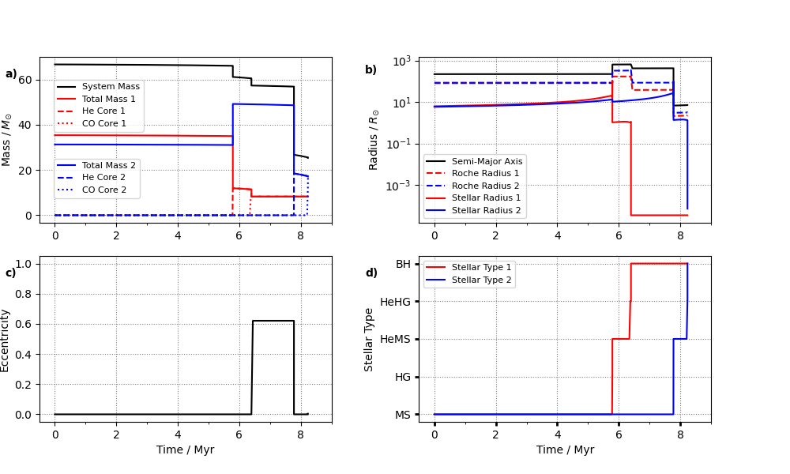

[//]: ## (grip -b getting_started.md)

# Getting Started

  * [1. Installing COMPAS and Dependencies](#1-installing-compas-and-dependencies)
    + [1.1 Instructions for Linux](#11-instructions-for-linux)
    + [1.2 Instructions for macOS](#12-instructions-for-macos)
    + [1.3 Setting up the Makefile and Compiling](#13-setting-up-the-makefile-and-compiling)
    + [1.4 Installing Python](#14-installing-python)
  * [2. Evolving your first binary](#2-evolving-your-first-binary)
    + [2.1 Running COMPAS out-of-the-box](#21-running-compas-out-of-the-box)
    + [2.2 Running COMPAS from a grid file](#22-running-compas-from-a-grid-file)
    + [2.3 Examining detailed output](#23-examining-detailed-output)
  * [3. Further queries](#3-further-queries)

## 1. Installing COMPAS and Dependencies
First change to the directory within which you wish to store your copy of COMPAS. In the rest of this document, we use as an example `~/codes`:

    cd ~/codes

Use `git clone` to download the COMPAS repository. If you do not have git installed, you may follow the instructions on https://www.atlassian.com/git/tutorials/install-git.

If you have not yet configured GitHub with SSH, you can clone over HTTPS:

    git clone https://github.com/TeamCOMPAS/COMPAS.git

With SSH configured, you can clone with

    git clone git@github.com:TeamCOMPAS/COMPAS.git

COMPAS requires a C++ compiler, and the libraries gsl and boost. We include installation instructions for Ubuntu/Linux OS and macOS.

### 1.1 Instructions for Linux
You will need to install the following packages (and their prerequisites) using your package manager:

| Package | Ubuntu (apt)       | Fedora (dnf) CentOS (yum) RHEL (yum) |
|---------|--------------------|---------------|
| g++     | g++                | gcc           |
| Boost   | libboost-all-dev   | boost-devel   |
| GSL     | libgsl-dev         | gsl gsl-devel |
| hdf5    | libhdf5-serial-dev | hdf5-devel    |

So, in Ubuntu, type

    sudo apt-get install g++ libboost-all-dev libgsl-dev libhdf5-serial-dev

In Fedora,

    sudo dnf install gcc boost-devel gsl gsl-devel hdf5-devel

In RHEL or CentOS,

    sudo yum install gcc boost-devel gsl gsl-devel hdf5-devel

### 1.2 Instructions for macOS
We suggest you first update to the latest version of macOS through the App Store. You can find what macOS version you are using by clicking on the Apple symbol on the top left of your screen and clicking "About This Mac".

The next step is to install or update Xcode. You can find it directly in the App Store or at https://developer.apple.com/xcode/. Note: Xcode installation requires around 20 GB of disk space. If you are low on disk space, you may consider installing a C++ compiler directly.
 
Once you have Xcode installed, open a Terminal, and run the following to install the required command line developer tools:
 
    xcode-select --install

Next, you need to install several extra libraries and python modules. Popular ways of installing them are via package managers MacPorts and Homebrew. We give instructions for installing boost and gsl with Homebrew. To install Homebrew, run

    /usr/bin/ruby -e "$(curl -fsSL https://raw.githubusercontent.com/Homebrew/install/master/install)"

 If the installation was successful, the following should run without error:

    brew --version

Now install gsl, boost, and hdf5 using Homebrew by running

    brew install gsl
    brew install boost
	brew install hdf5

### 1.3 Setting up the Makefile and Compiling
Time to actually install COMPAS. We first need to define an environment variable for the root directory of COMPAS in your shell start-up file for COMPAS to run properly. For example, if you use bash as your shell, open `~/.bashrc` with a text editor and put in the following:

    export COMPAS_ROOT_DIR=~/codes/COMPAS

where `~/codes` should be replaced with the path to the directory where you cloned the COMPAS repository. For this to take effect, either restart your bash session or run

    source ~/.bashrc

If your shell is zsh (which is the default of macOS 10.15), set the environment variable as above in `~/.zshrc` instead of `~/.bashrc`. If your shell is csh, set the environment variable in `~/.cshrc` using

    setenv COMPAS_ROOT_DIR ~/codes/COMPAS
    
Now go to the COMPAS source code directory:

    cd $COMPAS_ROOT_DIR/src

In this directory you will find the file `Makefile`, which you need to edit to point to your gsl, boost, and hdf5 include files and libraries. 

If you installed the packages with Homebrew, the package files are likely to be found in /usr/local/opt (in directories gsl, boost, and hdf5 respectively),
but if they are not found there you will need to use Homebrew to locate the files:

    $ brew info boost
    boost: stable 1.72.0 (bottled), HEAD
    Collection of portable C++ source libraries
    https://www.boost.org/
    /usr/local/Cellar/boost/1.72.0 (14,466 files, 648.5MB) *
    ...

Copy the path, which in this case is `/usr/local/Cellar/boost/1.72.0`, and add it to the appropriate lines of the Makefile:

    BOOSTINCDIR = /usr/local/Cellar/boost/1.72.0/include
    BOOSTLIBDIR = /usr/local/Cellar/boost/1.72.0/lib
 
Then, compile again by running `make -f Makefile`.

### 1.4 Installing Python
Python and some selected libraries are required for interfacing with the code, and also for post-processing. We recommend using python3. The matplotlib and numpy libraries should also be installed. The libraries scipy, astropy, and pandas are also used in some other scripts.

First check if you have python3 installed. If you do, the following should give you the version number:

    python3 --version

If you do not have python3 installed, install it by following the instructions below for your OS:

* For macOS: We recommend installing python and its libraries using MacPorts. You can follow the instructions on https://astrofrog.github.io/macports-python/
* For Linux, install `python3` using your package manager (e.g. in Ubuntu, run `sudo apt-get install python3`). We recommend installing the required python libraries using the package installer pip. E.g. To install numpy, run `pip install numpy`.

## 2. Evolving your first binary

### 2.1 Running COMPAS out-of-the-box
To start using COMPAS, and after the source code has been compiled, you need to go to `$COMPAS_ROOT_DIR/preProcessing/` and run the `runSubmit.py`, which reads the options from `compasConfigDefault.yaml` and overwrite the COMPAS defaults when specified.
The `compasConfigDefault.yaml` specifies all the program options (physics assumptions, output types) and runs COMPAS in the terminal. 
Your output should be similar to following.

	$ python3 runSubmit.py
	python_version = 3
	compas_executable_override None
	grid_filename None
	$COMPAS_ROOT_DIR/src/COMPAS --LONG-COMMAND-LINE

	COMPAS v02.25.10
	Compact Object Mergers: Population Astrophysics and Statistics
	by Team COMPAS (http://compas.science/index.html)
	A binary star simulator

	Start generating binaries at DATE

	0: Unbound binary: (Main_Sequence_>_0.7 -> Neutron_Star) + (Main_Sequence_>_0.7 -> Main_Sequence_>_0.7)

	Generated 1 of 1 binaries requested

	Simulation completed

	End generating binaries at DATE

	Clock time = 0.264009 CPU seconds
	Wall time  = 0000:00:00 (hhhh:mm:ss)

If that is the case, you have succesfully installed COMPAS and ran your fist binary.

As of v02.25.10, the `runSubmit.py` and `compasConfigDefault.yaml` combo are the preferred way to set up runs using python, instead of the prevously used `pythonSubmit.py` (and their adaptations).
We will eventually update the documentation to reflect this, but for now the references to `pythonSubmit.py` or `pythonSubmitDemo.py` refer to the combined options and commands python script that has been tested and used in releases previous than v02.25.10, including those of the methods paper.
The `pythonSubmit.py`, `pythonSubmitDemo.py`, and their functionality, will eventually be fully replaced by the `runSubmit.py` and `compasConfigDefault.yaml` combo. 

### 2.2 Running COMPAS from a grid file

We will now try to run a binary using a grid file. For this, you will need the python script `pythonSubmitDemo.py`, which specifies all the program options (physics assumptions, output types) and runs COMPAS in the terminal. For now, let's focus on evolving a single stellar system and examining the detailed output.

To start, change to the `examples/methods_paper_plots/detailed_evolution/` directory:

    cd $COMPAS_ROOT_DIR/examples/methods_paper_plots/detailed_evolution/

Here, you will find the script `pythonSubmitDemo.py` for this demo. This file is an older version of the `runSubmit.py` and `compasConfigDefault.yaml`

In population synthesis, the initial stellar population is usually generated by drawing the primary mass, secondary mass, semi-major axis, and eccentricity from their respective distributions specified in the program options. However, we illustrate COMPAS's ability to specify a grid of initial values for single and binary star evolution using COMPAS's grid functionality.

An example grid file, `Grid_demo.txt`, has been included in the current `detailed_evolution` directory. Open it with a text editor to view it:

    # Demo BSE Grid file
  
    --initial-mass-1 35.4 --initial-mass-2 31.3 --metallicity 0.001 --eccentricity 0.000000e+00 --semi-major-axis 1.02 --kick-magnitude-1 293.447 --kick-magnitude-2 260.142 --kick-phi-1 -1.013818 --kick-phi-2 -1.244273 --kick-theta-1 3.721039 --kick-theta-2 1.646224 --kick-mean-anomaly-1 3.265196 --kick-mean-anomaly-2 1.059172 

It should be clear that this grid file specifies a binary of zero-age main sequence stars with primary mass 35.4 Msol, secondary mass 29.3 Msol, metallicity 0.001, zero eccentricity, semi-major axis of 1.02 AU, and kick velocities for each component. For more detailed documentation of COMPAS's grid functionality for both single and binary stars, please see [Specifications](./COMPAS_Doc.pdf).

To tell the python submit script to take its input from this grid file, you usually need to open `$COMPAS_ROOT_DIR/preProcessing/compasConfigDefault.yaml` with a text editor, and specify the grid filename `grid: 'Grid_demo.txt'`.  And to print the time evolution of binary properties, we need to turn on detailed output: `detailed-output: True`.  COMPAS can produce logfiles of different types: HDF5, CSV, TSV, and TXT, which can be chosen by editing the line `logfile-type = 'HDF5'` (the default type is HDF5). For this demo, you can use the `pythonSubmitDemo.py` found in the current directory; this is a good option for v02.21.00 and previous releases. Alternatively, for more recent releases, you could choose to try and adapt the same options from the `$COMPAS_ROOT_DIR/preProcessing/compasConfigDefault.yaml` and the run via `$COMPAS_ROOT_DIR/preProcessing/runSubmit.py` script.

Now let's run COMPAS!

    $ python3 pythonSubmitDemo.py

    COMPAS v02.18.06
    Compact Object Mergers: Population Astrophysics and Statistics
    by Team COMPAS (http://compas.science/index.html)
    A binary star simulator

    Start generating binaries at Thu Feb 25 14:42:05 2021

    Evolution of current binary stopped: Double compact object
    0: Evolution stopped: (Main_Sequence_>_0.7 -> Black_Hole) + (Main_Sequence_>_0.7 -> Black_Hole)

    Generated 1 of 1 binaries requested

    Simulation completed

    End generating binaries at Thu Feb 25 14:42:05 2021

    Clock time = 0.108338 CPU seconds
    Wall time  = 00:00:00 (hh:mm:ss)

Congratulations! You've just made a binary black hole. And it didn't even take a second.

### 2.3 Examining detailed output
The COMPAS run just now produces a new directory `COMPAS_Output`, inside which you will find the following files/directories (here we assume `logfile_type = 'h5'` in the python submit file):

* `COMPAS_Output.h5`: The primary output file, containing hdf5 data groups for the relevant output physics. By default, and for a sufficiently large simulation, this will include `BSE_Common_Envelopes`, `BSE_Double_Compact_Objects`, `BSE_Supernovae`, and `BSE_System_Parameters`. 
* `Detailed_Output`: This directory contains the detailed output file, `BSE_Detailed_Output_0.h5`, which records the detailed time evolution of binary.  This file, and directory, is only produced if `detailed_output = True` in the python submit.
* `Run_Details`: An overview of the COMPAS flags used in this particular simulation. 

We examine `BSE_Detailed_Output_0.h5` to look at the evolution of the two stars. A default python plotting script has been included to visualise the data. Let's run the script:

    python3 detailed_evol_plotter.py

This should produce the following plot:  

COMPAS provides many tools for analysing and post-processing the data. Please view the post-processing documentation in `COMPAS/postProcessing`. 

## 3. Further queries
If you have any queries unanswered by this document, your best bet is to consult our more detailed [Specifications Document](./COMPAS_Doc.pdf), which is included in your installation at `$COMPAS_ROOT_DIR/docs/COMPAS_Doc.pdf`.

If this still doesn't answer your question, you can join the [COMPAS User Google Group](https://groups.google.com/forum/#!members/compas-user) to engage in discussions with COMPAS users and developers, or email your queries to compas-user@googlegroups.com.
