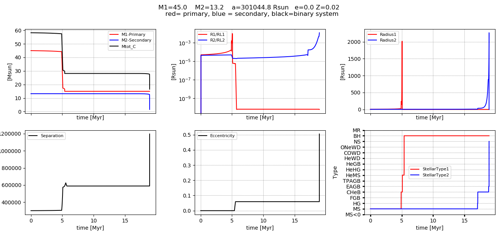

[//]: ## (grip -b getting_started.md)

# Getting Started

## 1. Installing COMPAS and Dependencies
First go to the directory that you wish to store your copy of the COMPAS repository. As an example, say this directory is `$HOME/codes`:

    cd $HOME/codes

 Use `git clone` to download the COMPAS repository. If you do not have git installed, you may follow the instructions on https://www.atlassian.com/git/tutorials/install-git.
 
 If you have not yet configured Github with SSH, you can clone over HTTPS:

    git clone https://github.com/TeamCOMPAS/COMPAS.git

With SSH configured, you can clone with

    git clone git@github.com:TeamCOMPAS/COMPAS.git

COMPAS requires a C++ compiller, and the libraries gsl and boost. We include installation instructions for Linux/Ubuntu OS and macOS. 

### 1.1 Instructions for Linux/Ubuntu OS
[//]: ## (Jeff, Reinhold and other Linux/Ubuntu users should check if instructions are correct)
If you do not have a C++ compiler, you may download the g++ compiler using

    sudo apt-get install g++

To download, install, and compile boost,

    sudo apt-get install libboost-all-dev

To download, install, and compile gsl,

    sudo apt-get install libgsl0ldbl

[//]: ## (What is this?)

N.B. Installing `libgsl0ldbl` often gives weird error messages. Instead of `libgsl0ldbl` installing, the following two libraries worked consistently: `libgsl-dev`, `lib32z1-dev`.

### 1.2 Instructions for macOS
[//]: ## (Ilya, Floor, Alejandro, and other Mac users should check if instructions are correct)
We suggest you first update to the latest version of macOS through the App Store. You can find what macOS version you are using by clicking on the Apple symbol on the top left of your screen and clicking "About This Mac".

The next step is to install or update Xcode. You can find it directly in the App Store or at https://developer.apple.com/xcode/. Note: Xcode installation requires around 20 GB of disk space. If you are low on disk space, you may consider installing a C++ compiler directly.
 
Once you have Xcode installed, open a Terminal, and run the following to install the required command line developer tools:

[//]: ## (Not sure if this still works)
 
    xcode-select --install

Next, you need to install several extra libraries and python modules. Popular ways of installing them are via MacPorts and via Homebrew. We give instructions for installing boost and gsl with MacPorts. To install MacPorts, download the latest version for your operating system on https://www.macports.org/install.php and install. If the installation was successful, the following should run without error:

    port version

After installing MacPorts, running the following commands will install gsl and boost.

    sudo port selfupdate
    sudo port install gsl
    sudo port install boost

The newly installed libraries will be placed in the default directory, `/opt/local/`.

### 1.3 Setting up the Makefile and Compiling
Time to actually install COMPAS. We first need to define an environment variable for the root directory of COMPAS in your shell start-up file for COMPAS to run properly. For example, if you use bash as your shell, open `~/.bashrc` with a text editor and put in the following:

    export COMPAS_ROOT_DIR=$/HOME/codes/COMPAS

where `$HOME/codes` should be replaced with the path to the directory where you cloned the COMPAS repository. For this to take effect, either restart your bash session or run

    source ~/.bashrc
    
Now go to the COMPAS source code directory:

    cd $COMPAS_ROOT_DIR/src

In this directory you will find the file `Makefile`. Compile by running:

    make -f Makefile

If this compiled without error messages, congratulations, you can start evolving binaries! Otherwise, you may need to edit `Makefile` to point towards the boost and gsl libraries.

### 1.4 Installing Python
Python and some selected libraries are required for interfacing with the code, and also for post-processing. We recommend using python3. The matplotlib and numpy libraries should also be installed. The libraries scipy, astropy, and pandas are also used in some other scripts.

First check if you have python3 installed. If you you do, the following should give you the version number:

    python3 --version

If you do not have python3 installed, proceed to install it following the instructions below for your OS:

* For macOS: We recommend installing python and its libraries using MacPorts. You can follow the instructions on https://astrofrog.github.io/macports-python/
* For Linux/Ubuntu OS, run `sudo apt-get install python3`. We recommend installing the required python libraries using the package installer pip. E.g. To install numpy, run `pip install numpy`.

## 2. Evolving your first binary
The python script pythonSubmitDefault.py specifies all the program options (physics assumptions, output types) and runs COMPAS in the terminal. Although the primary functionality of COMPAS is to evolve a whole population of binary stars rapidly, for now, let's focus on evolving a single stellar system and examining the detailed output.

To start, make a copy of pythonSubmitDefault.py to preserve the original script:

    cd $COMPAS_ROOT_DIR/src
    cp pythonSubmit.py pythonSubmit_your_name.py

By default, the output data will be written in your current working directory when you run pythonSubmit.py. If you want to change the output directory, set a different path behind output= in line 28 of the python submit: `output = os.getcwd()`.

### 2.1 Running COMPAS from a grid file
In population synthesis, the initial stellar population is usually generated by drawing the primary mass, secondary mass, semi-major axis, and eccentricity from their respective distributions specified in the program options. However, we illustrate COMPAS's ability to specify a grid of initial values for single and binary star evolution using COMPAS's grid functionality.

An example grid file, `BSE_Grid_demo.txt`, has been included in COMPAS in `$COMPAS_ROOT_DIR/src`. Open it with a text editor and look at what it looks like:

    # Demo BSE Grid file

    Mass_1, Mass_2, Metallicity_1, Metallicity_2, Eccentricity, Separation
    
    45.0, 13.2, 0.001, 0.002, 0.0, 1400.0

It should be clear that this grid file specifies a binary of zero-age main sequence stars with primary mass 45.0 Msol, secondary mass 13.2 Msol, primary metallicity 0.001, secondary metallicity 0.002, zero eccentricity, and semi-major axis of 1400.0 AU. For more detailed documentation of COMPAS's grid functionality for both single and binary stars, please see [Specifications](https://github.com/TeamCOMPAS/COMPAS/tree/master/docs/COMPAS_Doc.pdf).

We now have to tell our python submit to take its input from this grid file. To do this, open `pythonSubmit_your_name.py` with a text editor, and modify line 42 to

    grid_filename = 'BSE_Grid_demo.txt'

To print the time evolution of binary properties, we need to turn on detailed output in the python submit by modifying line 47 to

    detailed_output = True                         # WARNING: this creates a data heavy file

Now let's run COMPAS!

    $ python pythonSubmit_your_name.py
    ...
    COMPAS v02.05.01
    Compact Object Mergers: Population Astrophysics and Statistics 
    by Team COMPAS (http://compas.science/index.html)
    A binary star simulator

    Start generating binaries at Mon Sep 14 15:09:14 2020

    Evolution of current binary stopped: Double compact object
    0: Evolution stopped: Black_Hole + Neutron_Star

    Simulation completed

    End generating binaries at Mon Sep 14 15:09:14 2020

    Clock time = 0.168678 CPU seconds
    Wall time  = 0:0:0 (hh:mm:ss)

Congratulations! You just made a black hole-neutron star. And it didn't even take a second.

### 2.2 Examining detailed output
The COMPAS run just now produces four output files:

* `Compas_Log_BSE_Detailed_Output_0.csv`: Detailed time evolution of binary
* `Compas_Log_BSE_Double_Compact_Objects.csv`: Contains only data of binaries that formed double compact objects (in our example, we evolved one binary that became a black hole-neutron star, which was recorded in this file.)
* `Compas_Log_BSE_Supernovae.csv`: Information about supernovae.
* `Compas_Log_BSE_System_Parameters.csv`: Basic information about all evolved binaries.

We examine `Compas_Log_BSE_Detailed_Output_0.csv` to look at the evolution of the two stars. A default python plotting script has been included to visualise the data. Let's run the script:

    python $COMPAS_ROOT_DIR/docs/plotting_demo/demo_singlesys_plotter.py

This should produce the following plot:  

COMPAS provides many tools for analysing and post-processing the data. Please view the post-processing documentation in `COMPAS/postProcessing`. 

