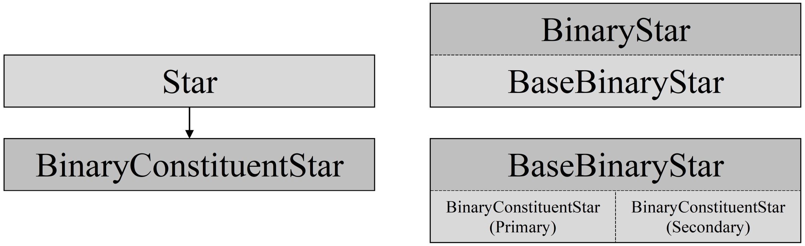

BSE class hierarchy
-------------------

The ``BSE`` class diagram is shown in :ref:`Figure 3 <fig-3>`.

.. _fig-3:

    Figure 3 BSE class & container diagram.

The ``BSE`` inheritance hierarchy is as follows:

    ``BinaryStar``
        ``BaseBinaryStar``
        
            ``Star`` → ``BinaryConstituentStar`` (star1) |br|
            ``Star`` → ``BinaryConstituentStar`` (star2)

The main class for binary star evolution is the ``BinaryStar`` class. The ``BinaryStar`` class is a wrapper that abstracts away the details
of the binary star and the evolution. Internally the ``BinaryStar`` class maintains a pointer to an object representing the binary star being
evolved, with that object being an instance of the ``BaseBinaryStar`` class. The ``BinaryStar`` class maintains a pointer to a second object,
representing the saved state of the binary star being evolved, with that object also being an instance of the ``BaseBinaryStar`` class. The 
second object is a copy of the binary star being evolved at some earlier timestep, facilitating reverting the binary star to a previous state.

The ``BaseBinaryStar`` class is a container class for the objects that represent the component stars of a binary system. An instance of the
``BaseBinaryStar`` class is a binary system being evolved by COMPAS, and contains a ``BinaryConstituentStar`` class object for each of the
component stars (i.e. the primary and secondary stars), as well as data structures and algorithms specific to the evolution of a binary system.
The ``BaseBinaryStar`` class also maintains pointers to the ``BinaryConstituentStar`` class objects considered to be the current donor and 
accretor during a mass transfer event, as well as pointers to the ``BinaryConstituentStar`` class objects considered to be the current 
supernova and companion star, should one of the stars undergo a supernova event.

The ``BinaryConstituentStar`` class inherits from the ``Star`` class, so objects instantiated from the ``BinaryConstituentStar`` class inherit
the characteristics of the ``Star`` class, particularly the stellar evolution model. The ``BinaryConstituentStar`` class defines member variables
and functions that pertain specifically to a constituent star of a binary system but that do not (generally) pertain to single stars that are not
part of a binary system (there are some functions that are defined in the ``BaseStar`` class and its derived classes that deal with binary star 
attributes and behaviour – in some cases the stellar attributes that are required to make these calculations reside in the ``BaseStar`` class so
it is easier and cleaner to define the functions there).

An instance of the ``BinaryConstituentStar`` class is a single component star of a binary system being evolved by COMPAS, and inhertis from the
``Star``, so will evolve over time through various SSE classes shown in :ref:`fig-1`. The ``BinaryConstituentStar`` class defines additional data
structures and algorithms (to the data structures and algorithms provided by the ``SSE`` classes) required to support the evolution of a binary 
system component star.

The ``BaseBinaryStar`` class is the main class for the underlying binary star object held by the ``BinaryStar`` class. The ``BaseBinaryStar`` 
class defines all member variables that pertain specifically to a binary star, and many member functions that provide binary-star specific 
functionality. Internally, the ``BaseBinaryStar`` class maintains pointers to the two BinaryConstituentStar class objects that constitute the 
binary star.

