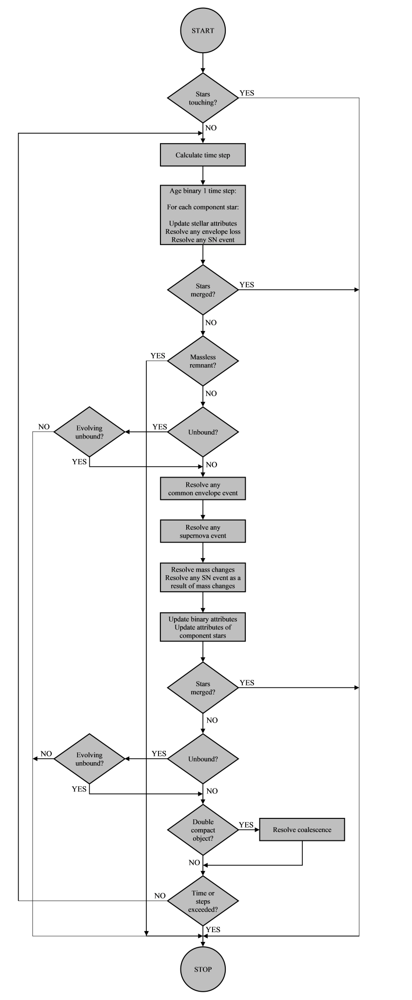

BSE evolution model
-------------------

The high-level binary evolution model is shown in :ref:`Figure 4 <fig-4>`.

.. _fig-4:

    Figure 4 High-level BSE evolution.

The binary evolution model is driven by the ``Evolve()`` function in the ``BaseBinaryStar`` class, which evolves the star through its entire 
lifetime by doing the following::

    if touching
        STOP = true
    else
        calculate initial time step
        STOP = false
    
    DO WHILE NOT STOP AND NOT max iterations:
    
        evolve a single time step
            evolve each constituent star a single time step (see the :ref:`SSE evolution model`)
        
        if error OR unbound OR touching OR Massless Remnant
            STOP = true
        else
            evaluate the binary
                calculate mass transfer
                calculate winds mass loss
    
                if common envelope
                    resolve common envelope
                else if supernova
                    resolve supernova
                else
                    resolve mass changes
    
                evaluate supernovae
                calculate total energy and angular momentum
                update magnetic field and spin: both constituent stars
    
            if unbound OR touching OR merger
                STOP = true
            else
                if NS+BH
                    resolve coalescence
                    STOP = true
                else
                    if WD+WD OR max time
                        STOP = true
                    else
                        if NOT max iterations
                            calculate new time step 
