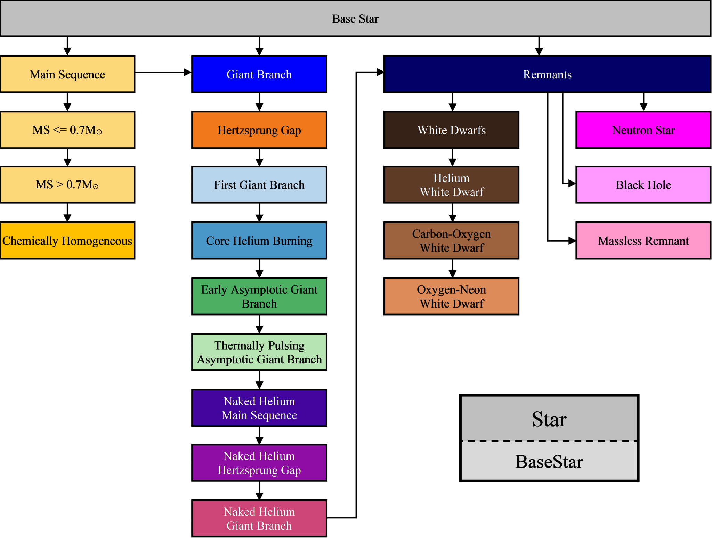

SSE class hierarchy
===================

:ref:`Figure 1 <fig-1>` shows the ``SSE`` class diagram, where the arrows indicate inheritance. The COMPAS ``C++`` code is implemented
using multiple inheritance, and all stellar classes also inherit directly from the ``BaseStar`` class (arrows not shown in 
:ref:`Figure 1 <fig-1>` for clarity). Each of the stellar classes encapsulates data structures and algorithms specific to the evolutionary
phase corresponding to the class.

The main class for ``SSE`` is the ``Star`` class. The ``Star`` class is a wrapper that abstracts away the details of the star and the 
evolution. Internally the ``Star`` class maintains a pointer to an object representing the star being evolved, with that object being 
an instance of one of the following classes:

    .. list-table::
       :widths: 25 75 
       :header-rows: 0
       :class: aligned-text

       * - ``MS_lte_07``
         - Main Sequence :math:`\small \leq 0.07 M_\odot`
       * - ``MS_gt_07``
         - Main Sequence :math:`\small \gt 0.07 M_\odot`
       * - ``CH``
         - Chemically Homogeneous
       * - ``HG``
         - Hertzsprung Gap
       * - ``FGB``
         - First Giant Branch
       * - ``CHeB``
         - Core Helium Burning
       * - ``EAGB``
         - Early Asymptotic Giant Branch
       * - ``TPAGB``
         - Thermally Pulsing Asymptotic Giant Branch
       * - ``HeMS``
         - Helium Main Sequence
       * - ``HeHG``
         - Helium Hertzsprung Gap
       * - ``HeGB``
         - Helium Giant Branch
       * - ``HeWD``
         - Helium White Dwarf
       * - ``COWD``
         - Carbon-Oxygen White Dwarf
       * - ``ONeWD``
         - Oxygen-Neon White Dwarf
       * - ``NS``
         - Neutron Star
       * - ``BH``
         - Black Hole
       * - ``MR``
         - Massless Remnant

which track the phases from :cite:`Hurley2000`, with the exception of the ``CH`` class for Chemically Homogeneous stars,
which are not described in :cite:`Hurley2000`.

Several other ``SSE`` classes are defined:

    ``BaseStar`` |br|
    ``MainSequence`` |br|
    ``GiantBranch`` |br|
    ``Remnants`` |br|
    ``WhiteDwarfs`` |br|

These extra classes are included to allow inheritance of common functionality.

The ``BaseStar`` class is the main class for the underlying star object held by the ``Star`` class. The ``BaseStar`` class defines all member
variables, and many member functions that provide common functionality. Similarly, the ``MainSequence`` and ``GiantBranch`` classes provide 
repositories for common functionality for main sequence and giant branch stars respectively, and the the ``Remnants`` and ``WhiteDwarfs`` classes
provide repositories for common functionality for remnant and white dwarf stars respectively.

.. _fig-1:

    Figure 1 SSE class & container diagram.

``CH`` (Chemically Homogeneous) class stars inherit from the ``MS_gt_07`` class because (in this implementation) they are just (large) main
sequence stars that have a static radius.

``HG`` (Hertzsprung Gap) class stars inherit from the ``GiantBranch`` class because they share the giant branch parameters described in 
:cite:`Hurley2000`, section 5.2.

Each class has its own set of member functions that calculate various attributes of the star according to the phase the class represents (using
the equations and parameters from :cite:`Hurley2000` where applicable).
