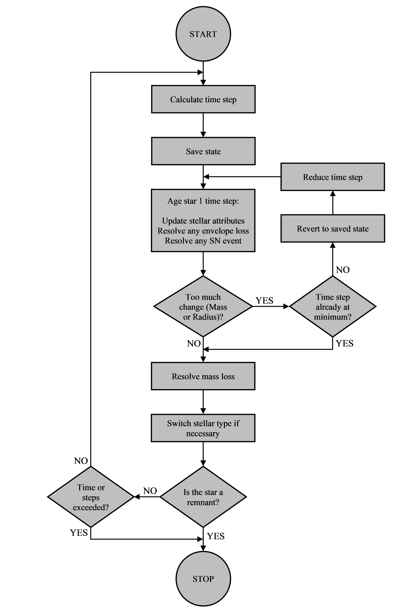

SSE evolution model
===================

The high-level stellar evolution model is shown in :ref:`Figure 2 <fig-2>`.

.. _fig-2:

    Figure 2 High-level SSE evolution.

The stellar evolution model is driven by the ``Evolve()`` function in the ``Star`` class, which evolves the star through its entire lifetime
by doing the following::

    DO:
        1. calculate time step

            a) calculate the giant branch parameters (as necessary)
            b) calculate the timescales|
            c) choose time step

        2. save the state of the underlying star object

        3. DO:

               a) evolve a single time step
               b) if too much change

                    i) revert to the saved state
                   ii) reduce the size of the time step

           UNTIL timestep not reduced

        4. resolve any mass loss

           a) update initial mass (mass0)
           b) update age after mass loss
           c) apply mass transfer rejuvenation factor

        5. evolve to the next stellar type if necessary

    WHILE the underlying star object is not one of: { HeWD, COWD, ONeWD, NS, BH, MR }

Evolving the star through a single time step (step 3a above) is driven by the ``UpdateAttributesAndAgeOneTimestep()`` function in the
``BaseStar`` class which does the following::

    1. check if the star should be a massless remnant
    2. check if the star is a supernova
    3. if evolution on the phase should be performed
         a) evolve the star on the phase – update stellar attributes
         b) check if the star should evolve off the current phase to a different stellar type
       else
         c) ready the star for the next time step

Evolving the star on its current phase, and off the current phase and preparing to evolve to a different stellar type, is handled by
two functions in the ``BaseStar`` class: ``EvolveOnPhase()`` and ``ResolveEndOfPhase()``.

The ``EvolveOnPhase()`` function does the following::

     1. Calculate Tau
     2. Calculate CO Core Mass
     3. Calculate Core Mass
     4. Calculate He Core Mass
     5. Calculate Luminosity
     6. Calculate Radius
     7. Calculate Perturbation Mu
     8. Perturb Luminosity and Radius
     9. Calculate Temperature
    10. Resolve possible envelope loss

Each of the calculations in the ``EvolveOnPhase()`` function is performed in the context of the star evolving on its current phase.
Each of the classes implements their own version of the calculations (via member functions) – some may inherit functions from the
inheritance chain, while others might just return the value unchanged if the calculation is not relevant to their stellar type.

The ``ResolveEndOfPhase()`` function does the following::

     1. Resolve possible envelope loss
     2. Calculate Tau
     3. Calculate CO Core Mass
     4. Calculate Core Mass
     5. Calculate He Core Mass
     6. Calculate Luminosity
     7. Calculate Radius
     8. Calculate Perturbation Mu
     9. Perturb Luminosity and Radius
    10. Calculate Temperature
    11. Evolve star to next phase

Each of the calculations in the ``ResolveEndOfPhase()`` function is performed in the context of the star evolving off its current 
phase to the next phase. The remainder of the code (in general terms) supports these main driver functions.
