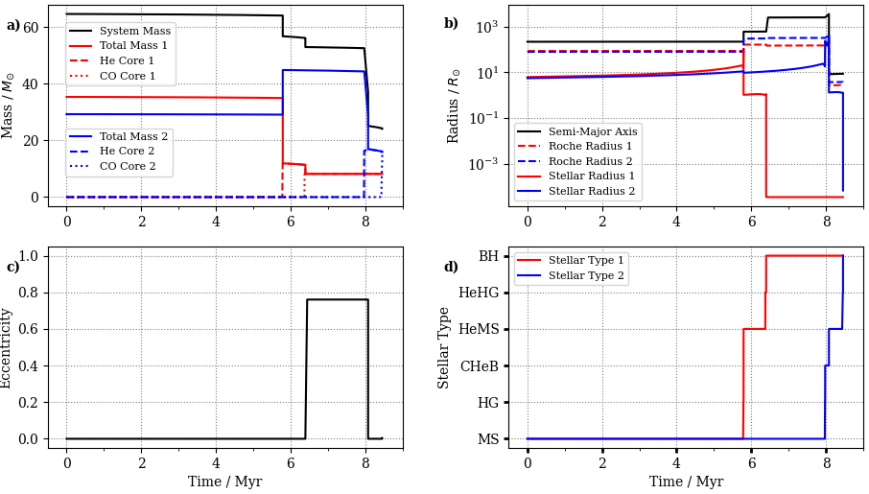

Examining detailed output
=========================

The COMPAS run from the tutorial creates a new directory ``COMPAS_Output``, inside which you will find the following files/directories 
(here we assume ``logfile_type = 'HDF5'`` in the python submit file):

**Run_Details** |br|
A record of the COMPAS command-line program options specified for this tutorial (these are the values set by ``compasConfigDefault.yaml`` when using 
``runSubmit.py``, or the COMPAS default values if not executing via ``runSubmit.py``).

**COMPAS_Output.h5** |br|
The primary output file, containing ``HDF5`` data groups for the relevant output physics. By default, and for a sufficiently large simulation, 
this will include:

    - BSE_Common_Envelopes
    - BSE_Double_Compact_Objects
    - BSE_RLOF
    - BSE_Supernovae
    - BSE_System_Parameters

**Detailed_Output** |br|
This directory contains the detailed output file, ``BSE_Detailed_Output_0.h5``, which records the detailed time evolution of binary. 
This file, and directory, is only produced if ``detailed_output = True`` in the python submit file.

We examine ``BSE_Detailed_Output_0.h5`` to look at the evolution of the two stars. A default python plotting script has been included to 
visualise the data. Let's run the script::

  python3 plot_detailed_evolution.py

This should produce a plot similar to :ref:`Figure 5 <fig-5>`:

.. _fig-5:

    Figure 5 Example COMPAS run.

COMPAS provides many tools for analysing and post-processing the data - see :doc:`../Post-processing/post-processing` for more details.

